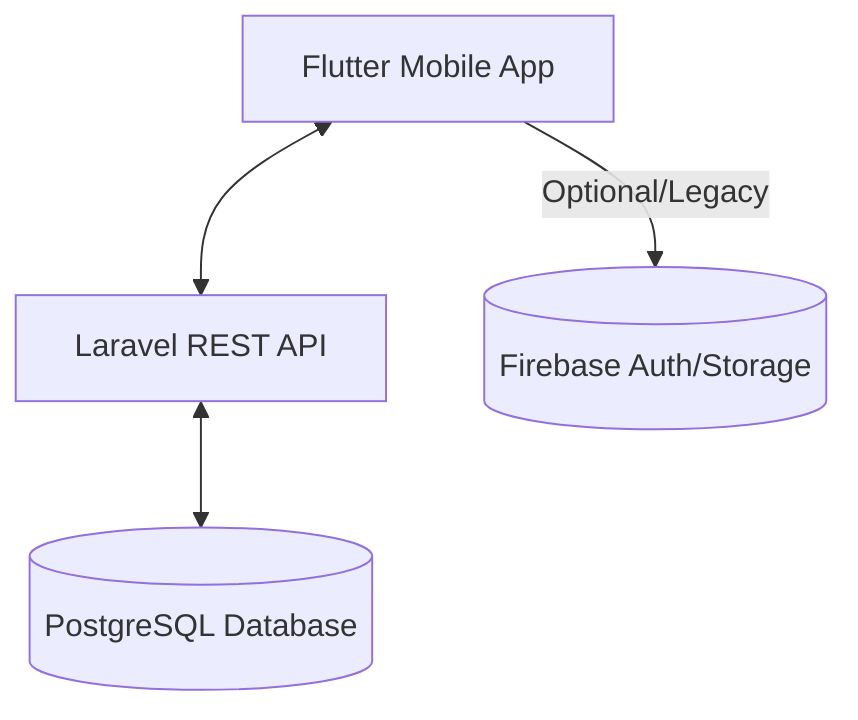

# Cyber Store: Application Logic & Architecture

The **Cyber Store** is a full-stack e-commerce application built with a **Flutter** mobile frontend and a **Laravel** backend, using **PostgreSQL** as the core database.

## 🏗 High-Level Architecture

---

## 📱 Frontend Logic (Flutter)

The frontend is organized using a **Provider-based state management** system. It focuses on a pixel-perfect UI and smooth transitions between shopping states.

### 1. State Management
- **AuthProvider**: Manages user session tokens (Sanctum), login/register status, and user profile data.
- **CartProvider**: Synchronizes the local shopping cart with the Laravel backend. Handles quantity updates, promo codes, and subtotal/tax calculations.
- **WishlistProvider**: Tracks user-liked products.
- **CheckoutProvider**: A temporary state machine that guides the user through the 3-step checkout flow (Address → Shipping → Payment).

### 2. Navigation Flow
- **Home**: Fetches dynamic banners and categories.
- **Product List**: Supports real-time filtering (by brand, price, memory) and sorting (by rating, newest, price). Uses pagination to load data.
- **Product Details**: Shows deep-dive specs, color/storage variants, and reviews.
- **Checkout**: A sequential process that validates user input at each step before allowing the final order creation.

---

## ⚙️ Backend Logic (Laravel)

The backend acts as a stateless REST API that handles the business rules and data persistence.

### 1. Product Logic (`ProductController`)
- **Dynamic Querying**: The `index` method builds complex PostgreSQL queries based on filter parameters (JSON-based spec filtering for memory/storage).
- **Ranking**: Products are ranked primarily by `rating` and `created_at`.
- **Review System**: Automatically calculates and updates the average rating of a product whenever a new review is added.

### 2. Cart & Order Logic (`CartController`)
- **Persistence**: Unlike traditional web apps that use sessions, this app saves the cart directly to PostgreSQL. This means a user's cart is consistent across different devices.
- **Variant Handling**: The cart logic treats the same product with different colors or storage options as unique items.

### 3. Database Schema (PostgreSQL)
The data is stored across several key tables:
- **`users`**: Auth data and basic profile.
- **`products`**: Main catalog data with a `specs` JSON column for flexible attributes.
- **`categories`**: Product taxonomy.
- **`carts` & `cart_items`**: Active shopping sessions.
- **`orders` & `order_items`**: Historic purchase data.
- **`reviews`**: User feedback linked to products and users.

---

## 🔄 Data Flow Example: Placing an Order

1. **Flutter**: User clicks "Buy Now" → `CartProvider` calls Laravel API `/api/cart`.
2. **Laravel**: Saves the item to the `cart_items` table in **PostgreSQL**.
3. **Flutter**: User goes to Checkout → Selects an Address (from `addresses` table).
4. **Flutter**: User clicks "Pay" → Sends all order details to `/api/orders`.
5. **Laravel**:
   - Validates stock.
   - Creates a record in the `orders` table.
   - Moves items from `cart_items` to `order_items`.
   - Clears the active cart.
6. **Flutter**: Navigates to the Success screen using the returned `order_id`.
